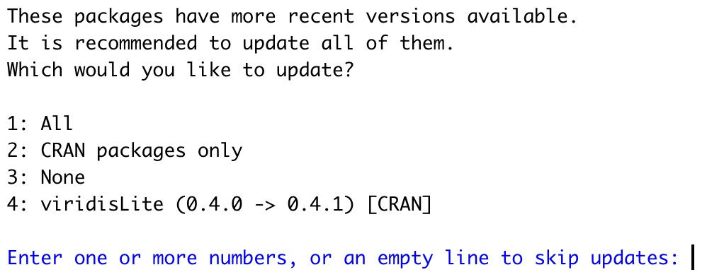

class: split-two, with-thick-border border-black

```{r setup, include=FALSE}
options(htmltools.dir.version = FALSE, servr.daemon = TRUE)
knitr::opts_chunk$set(cache=TRUE, autodep = TRUE, fig.retina = 3, message = FALSE, warning = FALSE)
library(tidyverse)
library(gt)
```

```{r, echo=FALSE, cache=FALSE}
xaringanExtra::use_progress_bar(color = "#e10020", location = "top", height = "5px")

# thanks to https://github.com/jvcasillas/xaringan_bib
source(here::here("static", "xaringan-bib.R"))
library(RefManageR)
BibOptions(check.entries = FALSE, 
           bib.style = "numeric", 
           cite.style = "numeric", 
           max.names = 0,
           dashed = TRUE)
bib <- ReadBib(here::here("static", "bibtex-file.bib"))
citet_charlie <- function(tag) {
  RefManageR::Citet(bib,
                    tag,
                    .opts = list(
                      bib.style = "numeric",
                      cite.style = "numeric",
                      max.names = 1
                    ))
}
```


.column.bg-main1[.content[
  .split-three[
 .row[.content[
 # 1. Understanding `data.frame` and `tibble`
 ]]
  .row[.content[
 # 2. Using `{readr}` for reading data
 ]]
   .row[.content[
 # 3. Using `{dplyr}` for cleaning and wrangling data
 ]]
 ]
]]

.column.bg-main1[.content.center.vmiddle[
  # 4. Using `{ggplot2}` for some basic exploratory data analysis
]]

---

class: inverse, center, middle

# What is the tidyverse?

---

# The tidyverse is two things

.pull-left[

- A collection of packages that are designed to work together really well.

- A collection of packages for all stages of the data science workflow.

<center>

</center>

]

--

.pull-right[

- An opinionated framework for how to work with data.

Some people<sup>1</sup> would describe the tidyverse as being an alternative to using base R.

It's not. 

The tidyverse is a useful approach to working with data that has a large ecosystem of tools. We'll use it to move quickly.

> After we've been using the tidyverse for a while I'll come back to this subject and provide further context.
]


.footnote[
[1] [`r citet_charlie("matloff_teaching_2022")`](https://github.com/matloff/TidyverseSkeptic)
]

---

background-color: #def3f7

# `r emo::ji("memo")` Task: Create a week-3 project
<p style='color:purple;margin-top:10px'>SLIDE 1 OF 1</p>

1. Create a new RStudio project called something like `week-3`.

---

# Installing and working with the tidyverse

To install the tidyverse collection of packages you need to run this code in the console.

```{r, eval=FALSE}
install.packages("tidyverse")
```

The tidyverse packages are split into two groups:

.pull-left[

- Core tidyverse packages which are loaded with this code

```{r}
library(tidyverse)
```

]

.pull-right[

- "Specialised" packages that need to be explicitly loaded, like `{readxl}` for importing data from Excel files.

```{r}
library(tidyverse)
library(readxl)
```


]

---

# Updating the tidyverse

In terms of real-world usage, keeping the tidyverse up to date is identical to keeping any R package up to date.

Thee

- When installing a *new* package the console might prompt you to update to new versions of packages

<center>

<center>

---

# Updating the tidyverse

In terms of real-world usage, keeping the tidyverse up to date is identical to keeping any R package up to date.

There are 3 different ways you might discover you should update a package.

- When installing a *new* package the console might prompt you to update to new versions of packages.

- When installing a *new* package the install fails due to an old package.

- You hear about an exciting new update to a package.

<hr>

There is a `tidyverse::tidyverse_update()` function but in practice I think it's very rarely used.

---

class: highlight-last-item

# Datasets we'll be using today

We're going to be using at least 3 different datasets today:

- The Global Burden of Disease study from `r citet_charlie("global_health_data_exchange_global_2022")`.

The Global Burden of Disease study is an extremely useful and rich dataset for understanding global (and comparative) health challenges.

There's an [excellent interactive tool for downloading data from the survey](https://vizhub.healthdata.org/gbd-results/) - but you do need to register for a free account to use it.

---

class: highlight-last-item

We're going to be using at least 3 different datasets today:

- The Global Burden of Disease study from the `r citet_charlie("global_health_data_exchange_global_2022")`.

- The `msleep` dataset from within the `{ggplot2}` package

.pull-left[


Lots (and lots) of R packages have datasets built into them, usually to demonstrate how to use functions inside the package.

The `msleep` dataset has data about mammalian sleep cycles from `r citet_charlie("savage_quantitative_2007")`

]

.pull-right[
```{r}
glimpse(msleep)
```

]

---

class: highlight-last-item

We're going to be using at least 3 different datasets today:

- The Global Burden of Disease study from the `r citet_charlie("global_health_data_exchange_global_2022")`.

- The `msleep` dataset from within the `{ggplot2}` package

- The `gapminder` dataset from the `{gapminder}` package

.pull-left[

In 2006 `r citet_charlie("hans_rosling_best_2006")` gave [an incredible TED talk where he introduced animated bubble charts](https://www.ted.com/talks/hans_rosling_the_best_stats_you_ve_ever_seen?language=en) as a tool to tell stories about global development.

Hans Rosling also founded the Gapminder Foundation to promote sustainable global development.

The `{gapminder}` package contains a subset of their data.
]

.pull-right[

<a href='https://r-graph-gallery.com/271-ggplot2-animated-gif-chart-with-gganimate.html'></a>

]

---

background-color: #def3f7

# `r emo::ji("memo")` Task: Get the GBD dataset

<p style='color:purple;margin-top:10px'>SLIDE 1 OF 2</p>

1. Add a sub-folder to your project called `data`

1. Inside of the `data` folder add a script called `obtain-data.R`

1. Add this code

```{r, eval=FALSE}
download.file("https://raw.githubusercontent.com/charliejhadley/eng7218_data-science-for-healthcare-applications_bcu-masters/main/static/datasets/data-example_global-burden-of-disease/data-example_global-burden-of-disease.csv",
              destfile = "data/global-burden-of-disease-data.csv")
```

5\. Run the code

---

background-color: #def3f7

# `r emo::ji("memo")` Task: Get the GBD dataset

<p style='color:purple;margin-top:10px'>SLIDE 2 OF 2</p>

1. Add a new `.Rmd` document called something like `intro-to-tidyverse.Rmd`

1. Use this document to follow along with examples, make notes and run code.

> We're going to move between topics quite a bit today. This won't be a very neat document, and that's okay.

---

# Reading data into R

The `{readr}` package provides excellent tools for reading *rectangular* data from *plain-text* files like `.csv` and `.tsv` files.

We need to think about creating reproducible file paths. The easiest way to do so is as follows:

1. Add a code chunk to your `.Rmd`

1. Choose a name for the dataset you're importing, it's recommended to use `raw` or something similar to denote this is your data pre-wrangling.

    ```{verbatim}
    disease_burden_raw <- 
    ```

---

.de-emphasis[
The `{readr}` package provides excellent tools for reading *rectangular* data from *plain-text* files like `.csv` and `.tsv` files.

We need to think about creating reproducible file paths. The easiest way to do so is as follows:

1\. Add a code chunk to your `.Rmd`

2\. Choose a name for the dataset you're importing, it's recommended to use `raw` or something similar to denote this is your data pre-wrangling.

```{verbatim}
disease_burden_raw <- 
```
]

3\. Call the appropriate function from `{readr}` for your data, add `""` in the 1st argument

   ```{r, eval=FALSE}
   disease_burden_raw <- read_csv("")
   ```

4\. Press `TAB` with your cursor inside the quotation marks to bring up an interactive file tree and select your file.

---

XXX !!!!!! DRAGONS!!!!!! XXXX

# Things need to do

## Data Wrangling

- Read in datafiles

- Understand difference between data.frame and tibble

- Use count(msleep, vore)
  
  - Use this to introduce %>% and |>

- Introduce filter() and select()

  - Tidy select functions
  
- Introduce group_by()

  - In msleep calculate mean sleep by vore
  
  - In {gapminder} calculate mean life expectancy per continent
  
  - In GDB calculate total injury deaths per year when selecting by "World Bank" region
  
    - This is quite involved! There are 3 metrics.
  
    - Requires str_detect() for world bank

- Use tibble() and tribble() to make fake datasets

  - Used to create a survey dataset for rowwise(starts_with("pain_level"), ~mean(.x)))
    
- Talk about mutate() usually working with columns

  - across() allows us to work across multiple columns
  
  - rowwise() allows us to perform row-wise calculations
    
    (using the tribble dataset)
  
  

## Data visualisation for understanding data

- Show datasaurus and gapminder again

- Make a scatter plot

  - msleep dataset
  
  - 
  
- Make a bar chart
  
  - msleep dataset, explain we will cover FACTORS
  
  - geom_bar() vs geom_col()

  
## Exercises

Offer 3 different exercises:

- "Hypothesis test dataset" https://raw.githubusercontent.com/charliejhadley/eng7218_data-science-for-healthcare-applications_bcu-masters/main/static/datasets/hypothesis-dataset/hypothesis-data.txt

- Tidy tuesday

- Timeline chart: with GBD data

  - This takes a bunch of wrangling AND data visualisation code
  
```{r, eval=FALSE}
gbd_raw %>% 
  filter(str_detect(location_name, "Region"),
         metric_name == "Percent",
         cause_name != "All causes",
         measure_name == "Deaths") %>% 
  arrange(year,
          location_name) %>% 
  select(year,
         location_name,
         cause_name,
         val,
         everything()) %>% 
  ggplot() +
  aes(x = year,
      y = val,
      color = cause_name) +
  geom_line() +
  facet_wrap(~location_name) +
  scale_color_viridis_d(labels = function(x) str_wrap(x, width = 20)) +
  scale_y_continuous(limits = c(0, 1),
                     labels = scales::label_percent()) +
  theme_bw(base_size = 14) +
  theme(strip.text.y = element_text(angle = 0))
```


---

# References Page 1

.references[

```{r, results='asis', echo=FALSE, warning=FALSE, cache=FALSE}
print_bib_rmd(bib, start = 1, stop = 10)
```

]


