layout: false
class: split-two, with-thick-border border-black

```{r setup, include=FALSE}
options(htmltools.dir.version = FALSE, servr.daemon = TRUE)
knitr::opts_chunk$set(cache=TRUE, autodep = TRUE, fig.retina = 3, message = FALSE, warning = FALSE)
library(tidyverse)
library(gt)
library(fivethirtyeight)
```

```{r ggplot2-slide-things, echo=FALSE}
library(ggpomological)
library(fontawesome)
colours_ggplot2_components <- as.list(set_names(ggpomological:::pomological_palette[1:5], c("aesthetics", "geoms", "scales", "guides", "themes")))
```


```{r, echo=FALSE, cache=FALSE}
xaringanExtra::use_progress_bar(color = "#e10020", location = "top", height = "5px")

# thanks to https://github.com/jvcasillas/xaringan_bib
source(here::here("static", "xaringan-bib.R"))
library(RefManageR)
BibOptions(check.entries = FALSE, 
           bib.style = "numeric", 
           cite.style = "numeric", 
           max.names = 0,
           dashed = TRUE)
bib <- ReadBib(here::here("static", "bibtex-file.bib"))
citet_charlie <- function(tag) {
  RefManageR::Citet(bib,
                    tag,
                    .opts = list(
                      bib.style = "numeric",
                      cite.style = "numeric",
                      max.names = 1
                    ))
}
```


.column.bg-main1[.content[
  .split-four[
 .row[.content[
 # 1. Why do we use charts to tell stories?
 ]]
  .row[.content[
 # 2. Evidence-based visual perception theory
 ]]
   .row[.content[
 # 3. Advice on choosing charts
 ]]
 .row[.content[
 # 3. Advice on using colour in charts
 ]]
 ]
]]

.column.bg-main1[.content.center.vmiddle[
  # 4. Using this advice to tell stories with charts built with `{ggplot2}`
]]

---

class: inverse, center, middle

# Why do we use charts?

---

class: middle, center

> <strike><h1>A picture is worth a thousand words</h1></strike>

---

# Data visualisations are demonstrably useful

There is considerable experimental evidence for data visualisations improving:

- Comprehension of data

- Decision making accuracy and confidence

--

Evidence has been collected using eye-tracking, survey filling and interviews. 

For a good overview of the available research see `r citet_charlie("eberhard_effects_2021")`. 

> Some of these studies consider tables to be a type of data visualisation.
>
> I agree with this! Tables are often awesome choices for presenting data - let's talk more about this later today.

---

# Data visualisations are demonstrably useful

.pull-left[
In 1973 `r citet_charlie("anscombe_graphs_1973")` published a paper designed to demonstrate...

> Graphs are essential to good statistical analysis.

To do so he simulated 4 datasets sharing **many** identical statistical properties.

]

.pull-right[

]


---

# Data visualisations are demonstrably useful

.pull-left[

However, if you visualised the datasets it was obvious these datasets were **fundamentally** different to one another.

These charts are now known as *Anscombe's quartet*.

]

.pull-right[

]

---

# Data visualisations are demonstrably useful

.pull-left[

The "Datasaurus Dozen" is a modern reimagining of the original quartet (`r citet_charlie("matejka_same_2017")`).

Datasaurus was originally created by Alberto `r citet_charlie("cairo_download_2016")`.

... there's now an R package for building your own metamers [eliocamp.github.io/metamer/](https://eliocamp.github.io/metamer/)

]

.pull-right[
<br>
<br>

]

---

class: middle, center, inverse

# Always. 
# ALWAYS visualise your datasets.

---

# Data visualisations are demonstrably awesome

.pull-left[


]

.pull-right[
There are several historical visualisations that have fundamentally changed social policy and behaviour.

This is a map from John `r citet_charlie("snow_mode_1855")` in 1855 that ties a cholera outbreak to a specific water pump.

]

---

# Data visualisations are demonstrably awesome

.pull-left[


]

.pull-right[
There are several historical visualisations that have fundamentally changed social policy and behaviour.

This is a map from John `r citet_charlie("snow_mode_1855")` in 1855 that ties a cholera outbreak to a specific water pump.

<hr>

Combined with Snow's statistical analyses this was a significant step towards the development and acceptance of germ theory.
]

---

# Data visualisations are demonstrably awesome

.pull-left[


]

.pull-right[
In exactly the same year, Florence `r citet_charlie("nightingale_notes_1858")` was creating charts to demonstrate the importance of **basic sanitation** in military hospitals.
]

---

# Data visualisations are demonstrably awesome

.pull-left[


]

.pull-right[
In exactly the same year, Florence `r citet_charlie("nightingale_notes_1858")` was creating charts to demonstrate the importance of **basic sanitation** in military hospitals.

This specific chart is very dramatic and quite rarely used. It's a polar area diagram or a Nightingale rose diagram
]


---

# Data visualisations are demonstrably awesome

.pull-left[


]

.pull-right[
But it's important to acknowledge that Nightingale used many different types of charts in her work.

Her charts were central to bringing basic sanitation standards to nursing and hospitals.
]

---

# Data visualisations are demonstrably awesome

.pull-left[
In 2006 `r citet_charlie("hans_rosling_best_2006")` gave [an incredible TED talk where he introduced animated bubble charts](https://www.ted.com/talks/hans_rosling_the_best_stats_you_ve_ever_seen?language=en) as a tool to tell stories about global development.

These charts helped demonstrate the value of interactive and animated data visualisations - which is why Google bought the tool behind the charts!
]

.pull-right[
<a href='https://r-graph-gallery.com/271-ggplot2-animated-gif-chart-with-gganimate.html'>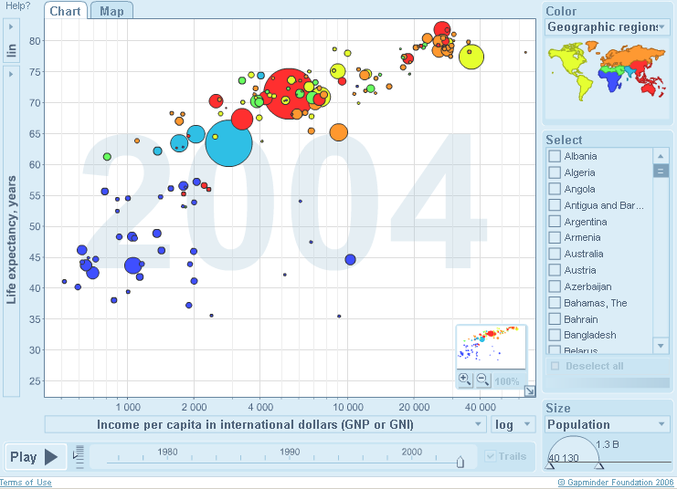</a>
]

---

# Data visualisations are demonstrably awesome

.pull-left[
A more recent example of a very powerful data visualisation is the spiralling global temperature GIF from 2016 by `r citet_charlie("hawkins_spiralling_2016")`.

We can create animated GIF with `{ggplot2}` via the `{gganimate}` package. In fact, `r citet_charlie("pat_schloss_recreating_2022")` has [YouTube video](https://www.youtube.com/watch?v=AYfjdcylAio) and [GitHub repo](https://github.com/riffomonas/climate_viz/tree/95168349ece3c1993e960767a4b4d6124b4abd4a) recreating this chart with R.
]

.pull-right[

]

---

class: middle, center, inverse

# Evidence-based visual perception theory

---

# Evidence-based visual perception theory

There is a wealth of evidence-based research in **how precisely or accurately** charts are perceived by readers.

--

.pull-left[
<center>

<br>
Source: <a href='https://commons.wikimedia.org/wiki/File:Eyetracker1.jpg'>Wikimedia.org</a>
</center>
]

.pull-right[

Our evidence comes from:

- Eye tracking. We're really good at measuring where the eye is looking, for how long and how intently.

- Asking trial participants to estimate or compare values in charts.

]


---

# Evidence-based visual perception theory

.pull-left[
<br>
<br>
<center>

<br>
Source: <a href='https://commons.wikimedia.org/wiki/File:Eyetracker1.jpg'>Wikimedia.org</a>
</center>
]

.pull-right[

.de-emphasis[

Our evidence comes from:

- Eye tracking. We're really good at measuring where the eye is looking, for how long and how intently.

- Asking trial participants to estimate or compare values in charts.
]

There are open debates<sup>1</sup> on **how our internal visual perception system works** - what the brain is doing.


]

.footnote[
[1] A good example is pie charts where we're still not sure what our brains are doing, but we know they're not measuring area thanks to `r citet_charlie("kosara_judgment_2016")`
]

---

# Elementary perceptual tasks

.pull-left[
Back in 1984 `r citet_charlie("cleveland_graphical_1984")` published their seminal paper on graphical perception theory where they defined "elementary perceptual tasks".

This study is the backbone of much of the research in this field.
]

.pull-right[
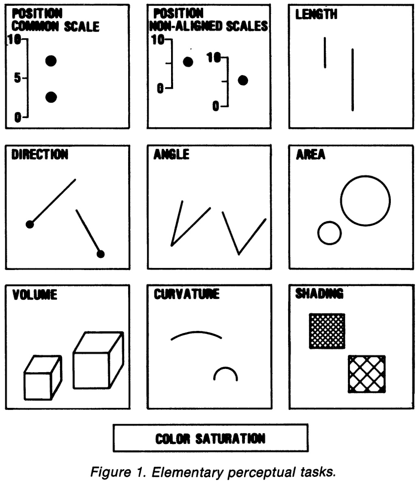
]

---

# Elementary perceptual tasks

.pull-left[
`r citet_charlie("cleveland_graphical_1984")` designed many experiments where participants were asked to:

- Identify the largest/smallest segment

- Estimate what % the smaller segment was of the larger segment

The accuracy of subject estimates was then statistically analysed.
]

.pull-right[
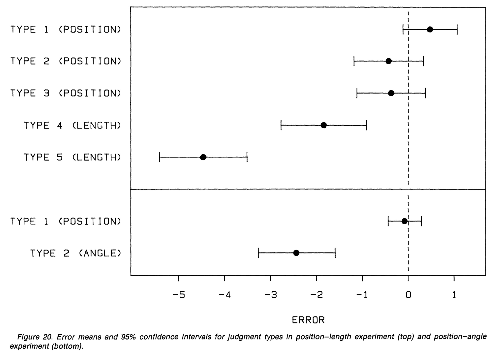
]

---

# Crowd-sourced evidence for perception theory

.pull-left[

]

.pull-right[
`r citet_charlie("heer_crowdsourcing_2010")` replicated this study using Amazon's Mechanical Turk with 3,481 participants in 2010.
]

---

# Crowd-sourced evidence for perception theory

.pull-left[

]

.pull-right[
`r citet_charlie("heer_crowdsourcing_2010")` replicated this study using Amazon's Mechanical Turk with 3,481 participants in 2010.

They validated the results of `r citet_charlie("cleveland_graphical_1984")` and provided further evidence that

> There is a hierarchy of elementary perceptual tasks - or chart elements - when **accuracy** matters.
]

---

## Ordering channels of communication (by accuracy)

.pull-left[
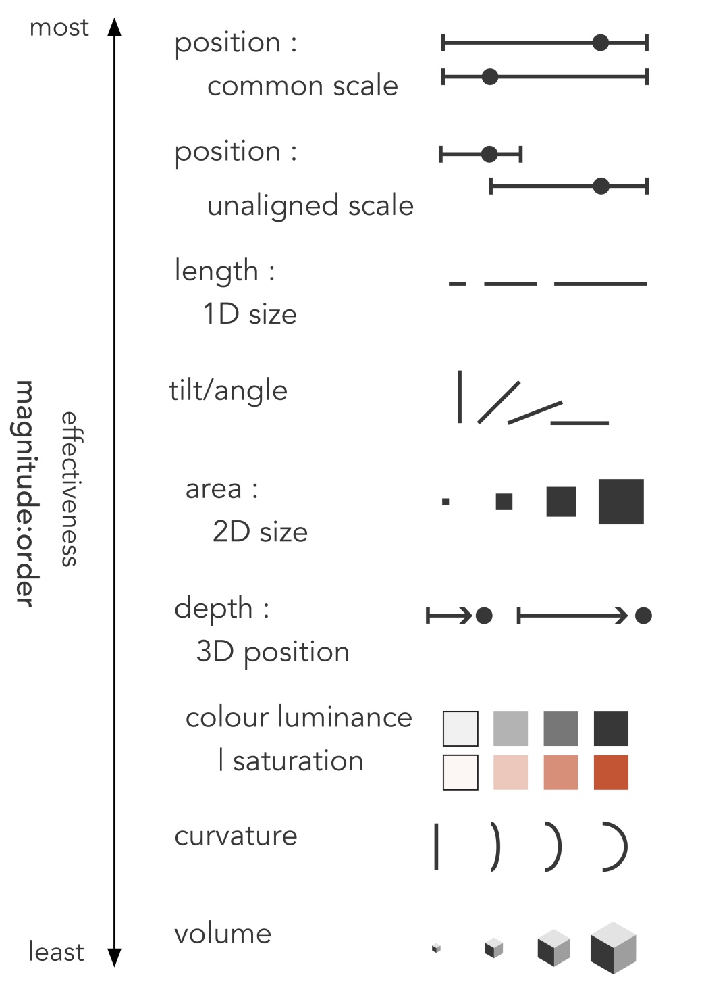
]

.footnote[
Images from `r citet_charlie("beecham_use_2021")`.
]

---

## Ordering channels of communication (by accuracy)

.pull-left[

]

.pull-right[
<br>
<br>
<br>
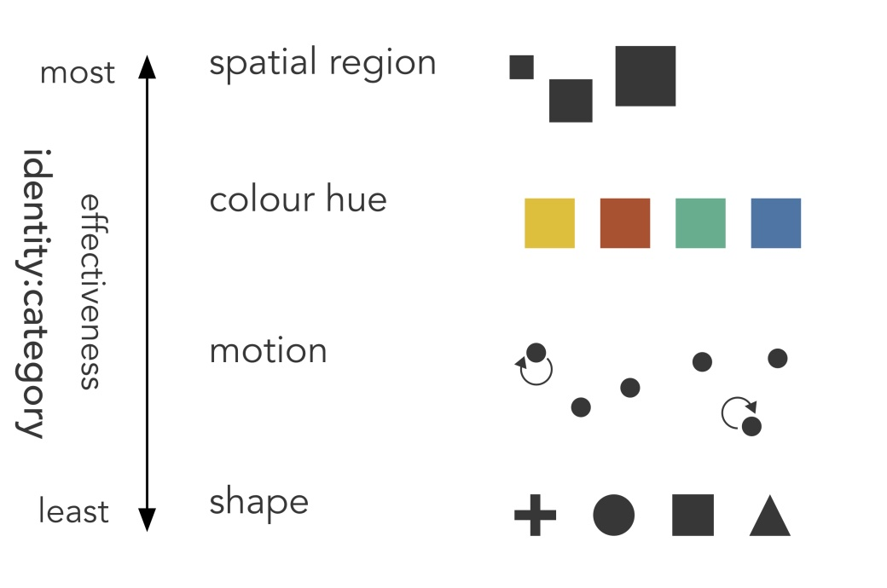
]

.footnote[
Images from `r citet_charlie("beecham_use_2021")`.
]

---

## ... real-world applications of visual perception theory

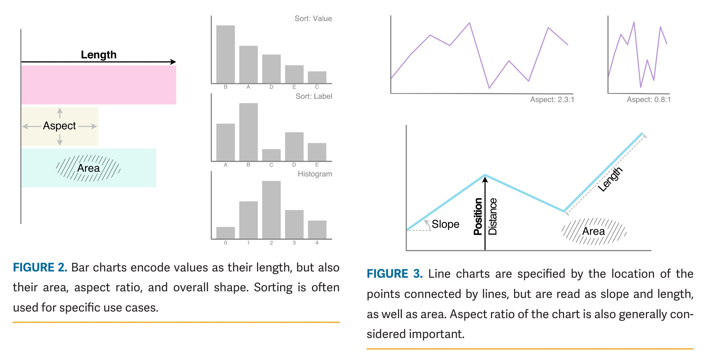

.footnote[
Images from `r citet_charlie("kosara_more_2022")`
]

---

## ... real-world applications of visual perception theory

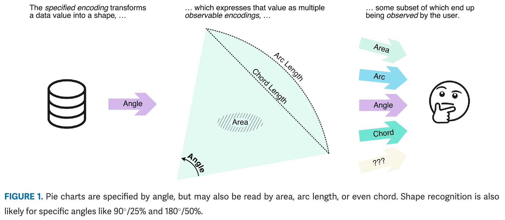

.footnote[
Images from `r citet_charlie("kosara_more_2022")`
]

---

## ... real-world applications of visual perception theory

<center>
<a href='https://twitter.com/irg_bio/status/1481214254351097859'>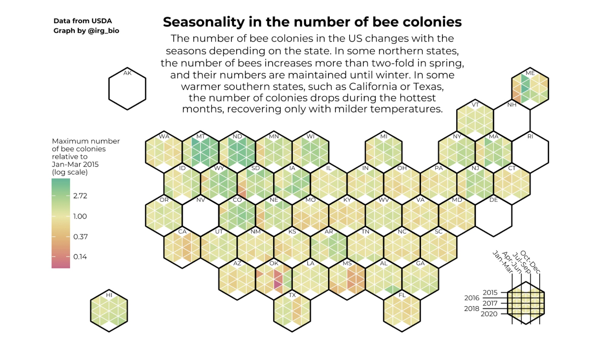</a>
</center>

.footnote[
Image found on Twitter from `r citet_charlie("iker_rivas-gonzalez_irg_bio_i_2022")`, code for chart available from `r citet_charlie("rivas-gonzalez_seasonality_2022")`.
]

---

class: split-33 with-thick-border

.column.bg-main1[.content.vmiddle[
# Why is someone <strike>reading</strike> measuring your chart?
]]
.column[.content[
  .split-four[
  .row.bg-main1[.content[
.big-note[To extract accurate values.]

The **magnitude** of chart elements.
  ]]
  .row.bg-main2[.content[
.big-note[To quantatively compare values.]

The **part to whole** or **relative magnitude** of chart elements.
  ]]
  .row.bg-main3[.content[
.big-note[To find the largest/smallest value]

The **ranking** of chart elements
  ]]
  .row.bg-main4[.content[
.big-note[To find *unusual* values]

The **distribution**, **ranking** or **magnitude** of chart elements
  ]]
]]]

---

class: split-33 with-thick-border

.column.bg-main1[.content.vmiddle[
# Why is someone reading your chart?
]]
.column[.content[
  .split-three[
  .row.bg-main1[.content[
.big-note[You have a story you want to tell]

There's lots we can do to help guide the reader to understand your chart and follow the story you're telling. We'll cover some examples during this course.
  ]]
  .row.bg-main2[.content[
.big-note[The reader wants to see the data]

Charts (and tables) are the best way to see the "big picture" of a dataset - a single value (eg mean) is kind of useless. Interactivity is really useful to allow readers to properly **explore** the dataset.
  ]]
  .row.bg-main3[.content[
.big-note[The reader has a preconception about the data]

Readers might be approaching a chart biased with a particular theory about the data. We can do our best to make our charts easy to read and avoid common pitfalls.
  ]]
]]]

.footnote[
I asked on [Twitter](https://twitter.com/charliejhadley/status/1565714347711762448?s=20&t=t00l52NTqksKMGys14pIKQ) about preconceptions.
]

---

class: inverse, middle, center

# How do we choose a chart?

---

class: split-two, with-thick-border border-black

.column.bg-main1[.content.vmiddle.center[

# Use data columns to choose charts

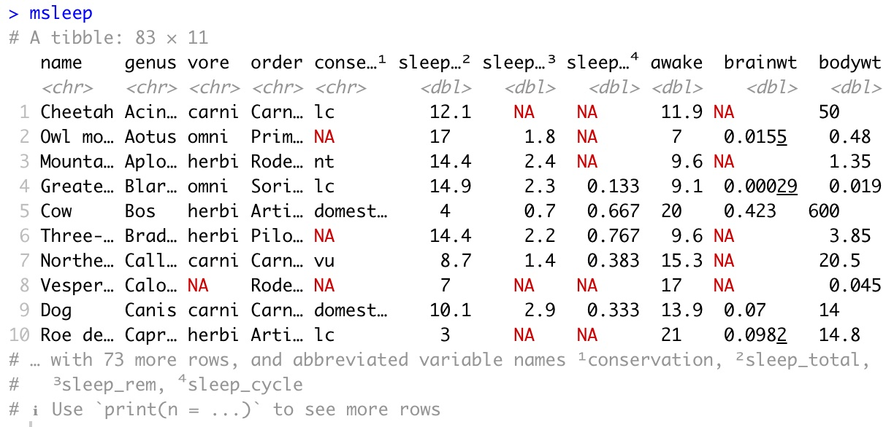

]]

.column.bg-main1[.content.center.vmiddle[

# Use your story to choose charts

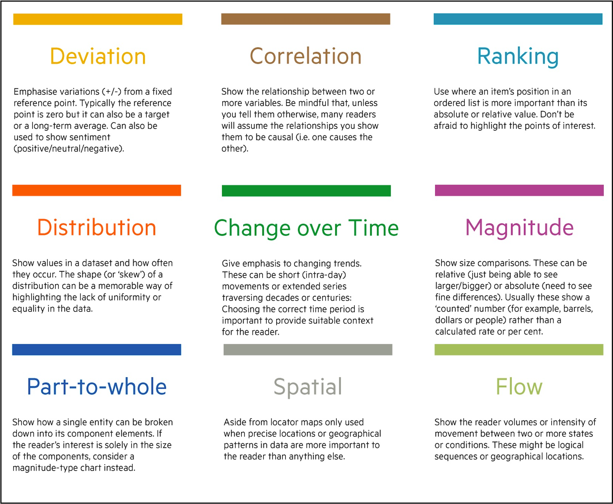
]]

---

# [data-to-viz.com](https://www.data-to-viz.com/)

.center[
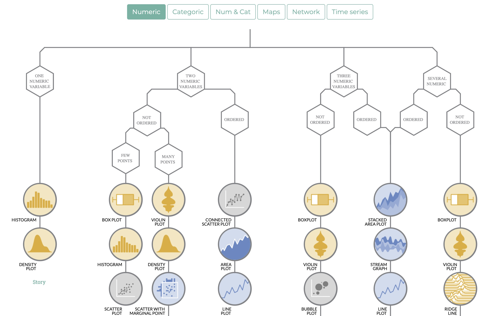
]

> This site also provides simple to follow instructions for making each chart with {ggplot2}

---

# [ft-interactive.github.io/visual-vocabulary](https://ft-interactive.github.io/visual-vocabulary/)

.center[

]

---

<center>
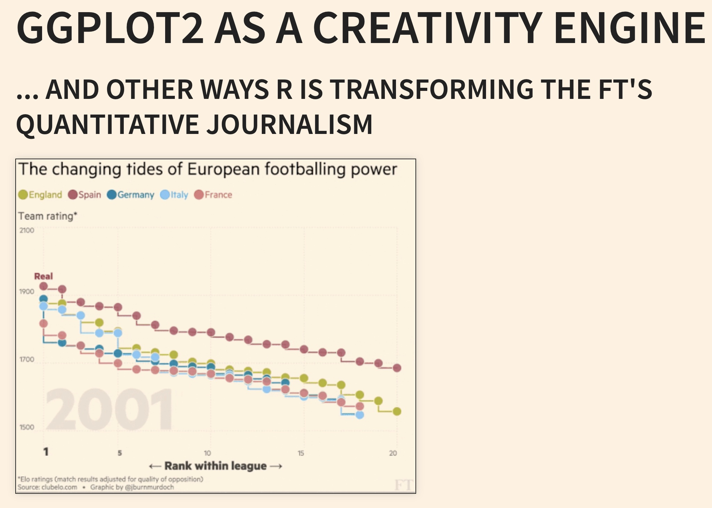
</center>

> John `r citet_charlie("burn-murdoch_ggplot2_2016")` has shared a lot about the use of R at the Financial Times, [including on Twitter](https://twitter.com/jburnmurdoch).

---

class: middle, center, inverse

# {ggplot2} for charts

---

# ggplot2: A Grammar of Graphics

`{ggplot2}` is an incredibly powerful and flexible tool for building static dataviz.

We can build (almost)<sup>1</sup> **any** static chart we can conceive of.
 
```{r, echo=FALSE, fig.height=3.8, fig.width=10, message=FALSE, warning=FALSE, dpi=150, cache=TRUE}
library("tidyverse")
library("lubridate")
library("patchwork")
library("fivethirtyeight")

gg_iris_scatter <- iris %>%
  ggplot(aes(x = Petal.Length,
             y = Sepal.Length)) +
  geom_point() +
  labs(x = "", y = "") +
  theme_bw()

gg_economics_line <- economics_long %>%
  ggplot() +
  geom_line(aes(date, value01, colour = variable), show.legend = FALSE) +
  labs(x = "", y = "") +
  theme_bw()


gg_marital_bar <- gss_cat %>%
  count(marital) %>%
  mutate(
    marital = fct_anon(marital, prefix = "type "),
    marital = fct_reorder(marital, n)) %>%
  ggplot() +
  geom_col(aes(x = marital, y = n)) +
  coord_flip() +
  labs(x = "", y = "") +
  theme_bw()

mtlong <- reshape2::melt(mtcars)


gg_quakes_histogram <- ggplot(quakes) +
  geom_histogram(aes(x = mag)) +
  labs(x = "", y = "") +
  theme_bw()

gg_bechden_violin <- bechdel %>%
  filter(domgross_2013 < 1e9) %>%
  # filter(domgross_2013 >= 1e6) %>%
  ggplot() +
  geom_violin(aes(x = clean_test,
                  y = domgross_2013),
              fill = "orange") +
  coord_flip() +
  labs(x = "", y = "") +
  theme_bw()

gg_diamonds_histogram <- ggplot(mtlong, aes(value)) + facet_wrap(~variable, scales = 'free_x') +
  geom_histogram(binwidth = function(x) 2 * IQR(x) / (length(x)^(1/3))) +
  labs(x = "", y = "") +
  theme_bw()
# ggsave("gg-saves/gg-iris-scatter.png",
#        gg_iris_scatter)
# ggsave("gg-saves/gg-economics-line.png",
#        gg_economics_line)

bump_data <- tribble(
  ~response, ~year, ~within_year_rank,
  "Yes", 2019, 1,
  "Maybe", 2019, 2,
  "No", 2019, 3,
  "Unsure", 2019, 4,
  "Unsure", 2016, 1,
  "No", 2016, 2,
  "Maybe", 2016, 3,
  "Yes", 2016, 4,
  "Yes", 2017, 3,
  "No", 2017, 2,
  "Unsure", 2017, 1,
  "Maybe", 2017, 4,
  "No", 2018, 1,
  "Yes", 2018, 2,
  "Maybe", 2018, 4,
  "Unsure", 2018, 3
)
gg_bump <- bump_data %>%
  ggplot(aes(x = year, y = within_year_rank, group = response)) +
    geom_line(aes(color = response), size = 2) +
    geom_point(aes(color = response), size = 4) +
    geom_point(color = "#FFFFFF", size = 1) +
    scale_y_reverse(breaks = 1:nrow(bump_data)) +
    scale_x_continuous(breaks = unique(bump_data$year), minor_breaks = unique(bump_data$year)) +
  coord_cartesian(ylim = c(1, length(unique(bump_data$response)))) +
  theme_bw() +
  theme(axis.ticks.y = element_blank(),
        axis.text.y = element_blank()) +
  labs(x = "", y = "") 


gg_iris_scatter + gg_economics_line + gg_marital_bar + plot_layout(ncol = 3) + 
  gg_quakes_histogram + gg_bechden_violin + gg_bump

```

.footnote[
[1] - Dual y-axis charts must be transformations of one another ([for good reasons](https://stackoverflow.com/a/3101876/1659890))
]

---

class: split-two with-border

.column[.content.vmiddle[

# Building blocks of a {ggplot2} chart

]]
.column[
  .split-five[
  .row.bg-main1[.content[
# `r fa(name = "ruler-combined", fill = colours_ggplot2_components$aesthetics)` <span style='color:`r colours_ggplot2_components$aesthetics`'>Aesthetics</span>
  ]]
  .row.bg-main2[.content[
# `r fa(name = "shapes", fill = colours_ggplot2_components$geoms)` <span style='color:`r colours_ggplot2_components$geoms`'>Geoms</span>
  ]]
  .row.bg-main3[.content[
# `r fa(name = "scale-balanced", fill = colours_ggplot2_components$scales)` <span style='color:`r colours_ggplot2_components$geoms`'>Scales</span>
  ]]
  .row.bg-main4[.content[
# `r fa(name = "tags", fill = colours_ggplot2_components$guides)` <span style='color:`r colours_ggplot2_components$geoms`'>Guides</span>
  ]]
  .row.bg-main5[.content[
# `r fa(name = "paint-roller", fill = colours_ggplot2_components$themes)` <span style='color:`r colours_ggplot2_components$themes`'>Theme</span>
  ]]
]]

---

class: split-two with-border

.column[.content.vmiddle[

# `r fa(name = "ruler-combined", fill = colours_ggplot2_components$aesthetics)` <span style='color:`r colours_ggplot2_components$aesthetics`'>Aesthetics</span>

]]
.column[
  .content[
Aesthetics are used to create mappings between columns in our datasets and the coordinate systems of our chart.

```{r, eval=FALSE}
msleep %>% 
  ggplot() +
  aes(
    x = sleep_total,
    y = sleep_rem,
    colour = vore
  )
```

`{ggplot2}` uses *tidy evaluation* to allow us to use naked column names in our code.

]
]

---

class: split-two with-border

.column[.content.vmiddle[

# `r fa(name = "shapes", fill = colours_ggplot2_components$geoms)` <span style='color:`r colours_ggplot2_components$geoms`'>Geoms</span>

]]
.column[
  .content[
Geoms use the aesthetic mappings we create to add *layers* to our chart.

```{r, eval=FALSE}
msleep %>% 
  ggplot() +
  aes(
    x = sleep_total,
    y = sleep_rem,
    colour = vore
  ) +
  geom_point()
```

<hr>

Let's go into a little bit more detail about this.

]
]

---

# XXX DRAGONS XXX

- Dataviz are demonstrably awesome

- Visual Perception Theory

- Let's make some actual ggplot2 charts / Grammar of Graphics

- Deciding on charts (FT Visual Vocabulary)

- Things to avoid / Advice (does this belong in visual perception theory?)

  - Starting at zero

  - Lots of different types of charts
  
  - Dynamite charts

- Sucking quote 

>  “There is no way of knowing nothing about a subject to knowing something about a subject without going through a period of much frustration and suckiness.”
“Push through. You’ll suck less.” Hadley Wickham, author of ggplot2

- Tables

  - Better than just text
  - But can be overwhelming
    - See doi.org/10.1017/S1537592707072209 for excellent examples
  - Using sparklines can really help

## Workshop

Factors.


---

# References Page 1

.references[

```{r, results='asis', echo=FALSE, warning=FALSE, cache=FALSE}
print_bib_rmd(bib, start = 1, stop = 10)
```

]


