class: split-two, with-thick-border border-black

```{r setup, include=FALSE}
# don't mind this code chunk, it just sets up a few things for the rest
# it doesn't appear, because the include argument above is FALSE...
options(htmltools.dir.version = FALSE, servr.daemon = TRUE)
knitr::opts_chunk$set(cache=TRUE, autodep = TRUE, fig.retina = 3, message = FALSE, warning = FALSE)
```

```{r, echo=FALSE}
xaringanExtra::use_progress_bar(color = "#36506A", location = "top", height = "5px")

# thanks to https://github.com/jvcasillas/xaringan_bib
source(here::here("static", "xaringan-bib.R"))
library(RefManageR)
BibOptions(check.entries = FALSE, 
           bib.style = "numeric", 
           cite.style = "numeric", 
           max.names = 0,
           dashed = TRUE)
bib <- ReadBib(here::here("static", "bibtex-file.bib"))
citet_charlie <- function(tag) {
  RefManageR::Citet(bib,
                    tag,
                    .opts = list(
                      bib.style = "numeric",
                      cite.style = "numeric",
                      max.names = 1
                    ))
}
```


.column.bg-main1[.content[
  .split-three[
 .row[.content[
 # 1. Getting to know R
 ]]
  .row[.content[
 # 2. Getting to know RStudio
 ]]
   .row[.content[
 # 3. Getting to know RMarkdown
 ]]
 ]
]]

.column.bg-main1[.content.center.vmiddle[
  # 4. Understanding the assessment template
]]

---

class: inverse, middle, center

# Getting to know R (and RStudio)

---

# The R Language

R is a scripting language and a very powerful tool for data analysis and presentation.

Primarily, this is thanks to the huge R user base (who are typically called *useRs*)

---

# What is R used for?

useRs have developed a vast range of free and open source libraries/packages covering a vast range of different knowledge/computational domains:

- Statistical Analysis

- Machine Learning

- Image Analysis

- Network Analysis

- ... and many more

---

# R and CRAN

Unlike **any** other programming language there is a unified system for **installing packages easily on Windows, macOS and Linux**.

This is also where you downloaded R from - the Comprehensive R Archive Network [(CRAN)](cran.r-project.org).

---

# ... Windows users and RTools

There's always a slight complication to these things.

Both Linux and macOS come with a number of developer-focused tools pre-installed that aren't in Windows, it's really easy to install them.

> Navigate to [https://cran.r-project.org/bin/windows/Rtools/](https://cran.r-project.org/bin/windows/Rtools/) and download the most recent of the tools.

---

# R, CRAN and Packages

There are 18000+ packages on CRAN. 

Deciding which packages to use (and trust) can be a daunting part of becoming confident and **fluent** in R.

---

# The R Console

R is the name of the programming language and *console* within which many useRs write and evaluate their code.

To use R on your local machine you must [download](https://cran.r-project.org/bin/windows/base/) and install the R Console, it's available on Windows, macOS and Linux.

.pull-left[

Like most consoles, this application provides **only** the following functionality: 
- Write code and script files

- Evaluate code and script files
]

.pull-right[

]

---

# The R Console

While it is possible to use the R console for all of your R needs, it's not the best experience you can have.

I highly recommend you use RStudio instead.

---

# 

RStudio provides the **most rich and fullest** experience of the R language and what you can do with R.

RStudio is a free, open-source IDE (integrated development environment)...

## What's an IDE?

IDEs are applications designed and used by software developers to assist in the development, debugging and testing of code.

If you're writing R scripts, **you're an R developer**. You'll find benefits to using an IDE to develop your code base. Even if it's only a few lines long.

> In your CV you might want to add a section about IDEs, particularly if you learn more than one.

---

# RStudio and Data Science

RStudio is not just an IDE. It's awesome. 

In this course, we'll make use of the following features:

- Relative file paths and transportable code thanks to RStudio projects

- Built-in documentation reader

- Built-in tools for designing and running Shiny apps

- Built-in viewer for interactive dataviz built with `{htmlwidgets}`

- Support for add-ins to improve user experience, including `{reprex}` and `{styler}`

---

background-color: #def3f7

# `r emo::ji("memo")` TASK: Get familiar with RStudio

Let's make sure you can do the following:

- Identify the console, environment and files tab

- Understand the difference between script files and console

- Create new script files

---

# Base R and R Packages

When R is installed on your computer the machinery necessary to run R code is added to your computer and a number of "base" packages<sup>1</sup> including; `stats`, `utils` and `graphics`. 

These packages will not get you far in life, unless you're prepared to write a **lot** of code from scratch. 

But you can guarantee that any code samples you see online referring to "base R" will work without having to install additional libraries.

.footnote[
[1] See <a href="http://stackoverflow.com/a/9705725/1659890">stackoverflow.com/a/9705725/1659890</a> for further details.
]

---

# The 3 steps to using R packages

In general, if you want to make use of an R package these are the steps you must go through:

1. Install package on your machine<sup>1</sup>

1. Load package in your script file

1. Use the functions/data sets loaded from your package

.footnote[
[1] You only need to do this once per machine.
]

---

# 1. Installing R packages

We use the following function to install a package:

```{r, eval=FALSE}
install.packages("ggplot2")
```

It's highly recommend you *only write this code in your console* and **never in your script file**.

<br>

- Packages only need to be installed once.

- `install.packages` will try to install the latest CRAN version of a package

- The latest CRAN version of your package *may* affect your code's output

---

# `r emo::ji("spiral_notepad")` ASIDE: Packages/Libraries

For all intents and purposes, library and package can be used completely interchangeably in R.

However, there is a general rule of thumb:

- When the thing is **not being used on your local machine** it is usually called a package:

    - We install, update and remove packages.
    - We develop packages.
    - We search for packages online.
    - We look up a function from a package.

- When the thing **is being used on your local machine** it is called a library:

    - We load a library.
    - The directory containing a package on your local machine is called the package library.

---

background-color: #def3f7

# `r emo::ji("memo")` Task: Install `{ggplot2}`

<p style='color:purple;margin-top:10px'>SLIDE 1 OF 2</p>

1. Run `install.packages("ggplot2")` in the console

---

background-color: #def3f7

# `r emo::ji("memo")` Task: Install `{ggplot2}`

<p style='color:purple;margin-top:10px'>SLIDE 2 OF 2</p>

1. Run `install.packages("ggplot2")` in the console

1. In a script file, expose the functions in the package by typing

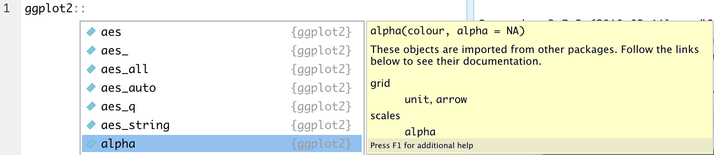

---

# 2. Loading packages

Packages are designed to be loaded as follows:

```{r, eval = FALSE}
library("ggplot2")
```

This achieves the following:

- `{ggplot2}` functions are now available in RStudio's auto-completion
- any datasets<sup>2</sup> from the package are available for us to use

.footnote[
[1] Loaded/attached... it's fairly complicated.

[2] For instance, a dataset about Star Wars is made available when the `{dplr}` package is loaded.
]

---

# 3. Using packages

You're now free to use the package as the developer intended.

However, there are several big sanity warnings when it comes to using packages:

- The package might be written poorly (unoptimised, or with incorrect assumptions)

- The package may well become unsupported in the future if the developer does not maintain it

- Not all packages are designed to play nicely with one another, manipulating your code to play nice with `{obnoxiousR}` might be harder than simply writing in base R

---

background-color: #def3f7

# `r emo::ji("bandage")` Common Errors: Packages
<p style='color:purple;margin-top:10px'>SLIDE 1 OF 3</p>

1. Forgetting to **install** a package

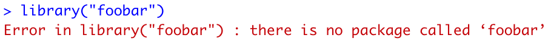

If you see this error it's because you've either misspelled the package, or forgotten to install it.

You can fix this by installing the package in your console and then trying to load the package again.

---

background-color: #def3f7

# `r emo::ji("bandage")` Common Errors: Packages
<p style='color:purple;margin-top:10px'>SLIDE 2 OF 3</p>

1. Forgetting to **install** a package

1. Forgetting to **load** a package

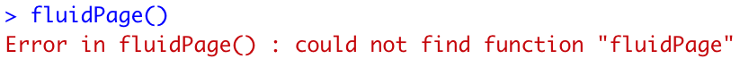

If you see this error it's because R can't find the function you've written.

It could be misspelled, or you may have forgotten to load the library.

Fix this by running `library("package")`.

---

background-color: #def3f7

# `r emo::ji("bandage")` Common Errors: Packages
<p style='color:purple;margin-top:10px'>SLIDE 3 OF 3</p>

1. Forgetting to **install** a package

1. Forgetting to **load** a package

<hr>

Best Practice: Always load packages at the top of your script files.

<hr>

To aid you in reading these materials, we follow two conventions:

- `{ggplot2}` means the *package* ggplot2.

- `ggplot()` means a *function* called ggplot<sup>1</sup>.

---

class: inverse, middle, center

# Brackets in the R language

---

# Brackets matter

It's crucial you can quickly distinguish betwen the different brackets in the R language, so that when you are:

- Reading code... we know what's what

- Writing code... we know what to write 

- Fixing code... we can find missing brackets

Let's test your knowledge of what brackets mean in the R language.

---

background-color: #def3f7

# `r emo::ji("memo")` Test: Round brackets `()`

What do we know about the following code because there are `()`?

```{r, eval=FALSE}
praise::praise()
```
 

--

`praise` is a function, round brackets are used to encapsulate (or wrap) arguments passed to a function.

--

As in the example above, some functions have default arguments so can be called simply with `praise()`

--

Multiple arguments are deliminated by commas, for example:

```{r}
rep("hello world", 2)
```

---

background-color: #def3f7

# `r emo::ji("memo")` Test: Square Brackets `[]`

What do we know about the following code because there are `[]`?

```{r, eval=FALSE}
islands["Timor"]
```
 
--

`islands` is an object, the `[]` are being used to extract an element from the object.

--

In this instance, we are extracting an element by it's name "Timor".

--

Often items are extracted according to their "relative position in the object", which is called **indexing**

```{r}
islands[3]
```


---

background-color: #def3f7

# `r emo::ji("memo")` Test: Curly brackets or braces `{}`

What do the `{}` achieve in the following code?

```{r, eval = FALSE}
var_1 <- 239
var_2 <- 151
var_3 <- {var_1*var_2 + var_2} / var_2

var_1 ^ {var_2 + var_3}
```

--

Braces are used in the same way `()` are used when we write mathematics by hand, they allow multiple things to be done together.

---

# Braces in loops  and conditions

Braces are used to denote the *body* of loops and condiitons:

```{r, eval=FALSE}
for (variable in vector) {
  ## This is the body of the loop
}
```

```{r, eval=FALSE}
if (condition) {
  ## This is the body of TRUE condition
} else {
  ## This is the body of the FALSE condition
}
```


---

background-color: #def3f7

# `r emo::ji("memo")` Test: foo$bar

What do we know about `iris` because of the `$` in the following code?

```{r, eval = FALSE}
iris$Species
```

--

`iris` is an object with named elements (specifically a `data.frame`), the `$` provides us autocompletion of names as we type.

--

We could just have well of indexed this object as follows:

```{r, eval = FALSE}
iris[, "Species"]
```

---

# Indexing, subsetting and filtering data

Most R users work with rectangular data stored in .csv/.xlsx files and need to extract rows that meet certain criteria. 

This is an extremely common task that we'll perform many times during this course. 

It's called filtering, subsetting or indexing, depending on the method that we choose.

```{r message=FALSE, warning=FALSE, eval = FALSE}
iris[which(iris$Species == "versicolor"), ] # indexing

subset(iris, Species == "versicolor") # subseting
```

We'll strongly prefer filtering with the tidyverse for reasons we'll explain later

```{r message=FALSE, warning=FALSE, eval = FALSE}
library("tidyverse")
filter(iris, Species == "versicolor") # filtering
```

---

class: inverse, center, middle

# RStudio Projects

---

# Good habits from the start

It's important when you start programming to keep good habits in mind, they're sometimes quite difficult to impose once you've started.

One of the best R habits to keep is to separate your work into distinct **RStudio Projects**.

This has the following benefits:

- Consciously separates work packages - making it easier to context switch

- Makes code transportable - as all file paths are relative

- Simplifies usage of git alongside R

---

# `setwd()` is bad practice

Many users of R begin their work with:

```{r, eval=FALSE, include=TRUE}
setwd("/Users/charliejhadley/GoogleDrive/courses/interactive-stat-viz")
```

This is a bad way to start.

- You've immediately tied your code to only working on your operating system AND your machine.

<hr>

This advice is slightly out of context as we're going to start building simple `{ggplot2}` charts before we import datasets, so we'll come back to this point later. 


---

background-color: #def3f7

# `r emo::ji("memo")` Task: RStudio Projects Round Trip
<p class='task-slide-count'>SLIDE 1 OF 4</p>

We're going to be creating **many** projects during this course, they should all be saved within the `ggplot2-example-projects` folder you downloaded earlier

1. Add a sub-folder to this location called "01-workshop"

1. Save each script file into this folder

1. Close all open script files in RStudio

---

background-color: #def3f7

# `r emo::ji("memo")` Task: RStudio Projects Round Trip
<p class='task-slide-count'>SLIDE 2 OF 4</p>

RStudio has a built-in menu for working with projects in the top-right hand corner of the screen.

1. Click on the menu

1. Select "New Project"

<center>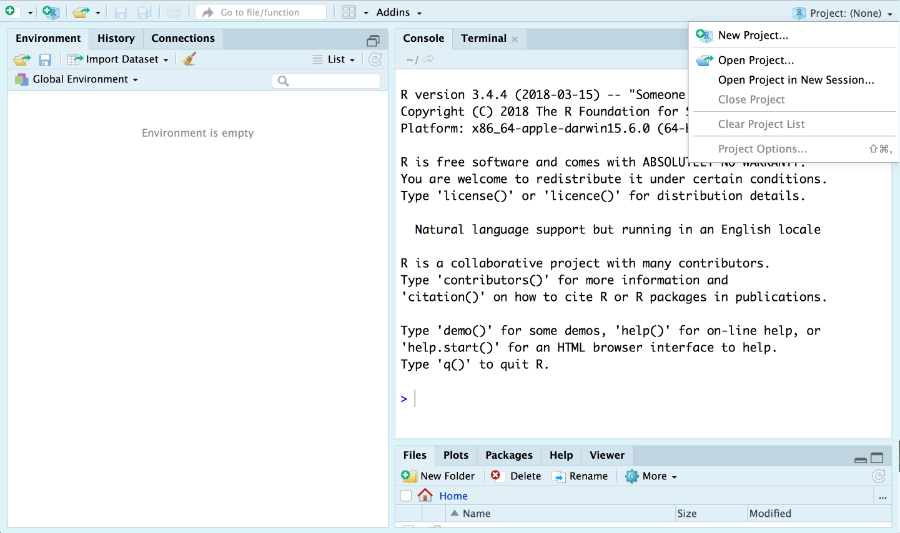</center>

---

background-color: #def3f7

# `r emo::ji("memo")` Task: RStudio Projects Round Trip
<p class='task-slide-count'>SLIDE 3 OF 4</p>

1. Choose "Existing Directory"

1. Navigate to the `01-workshop` directory

1. Create the project

.pull-left[
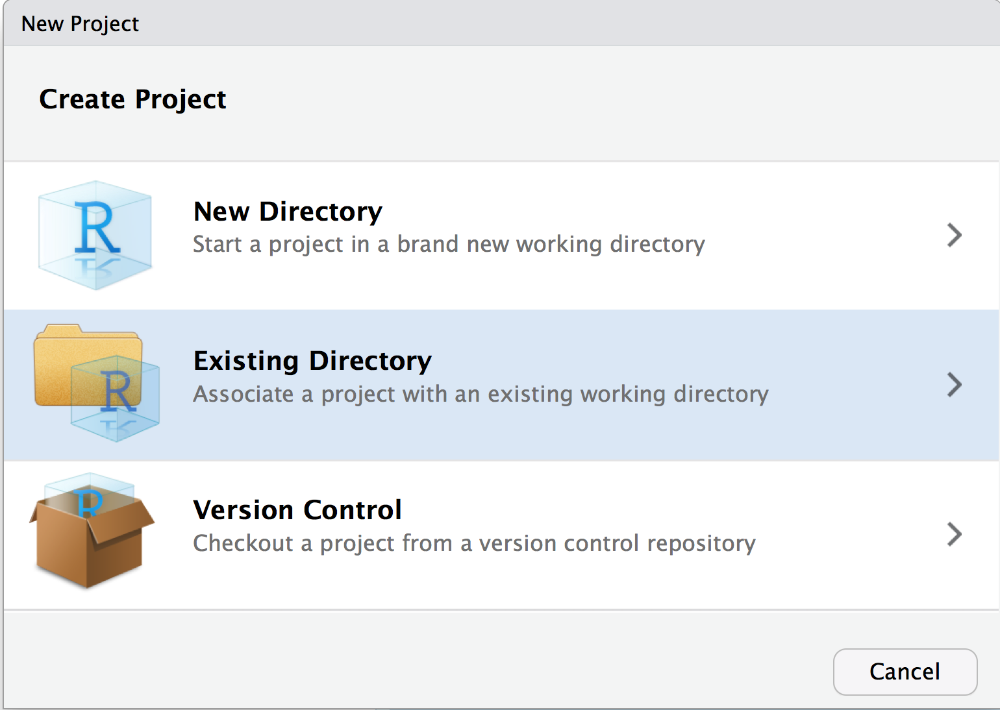
]

.pull-right[
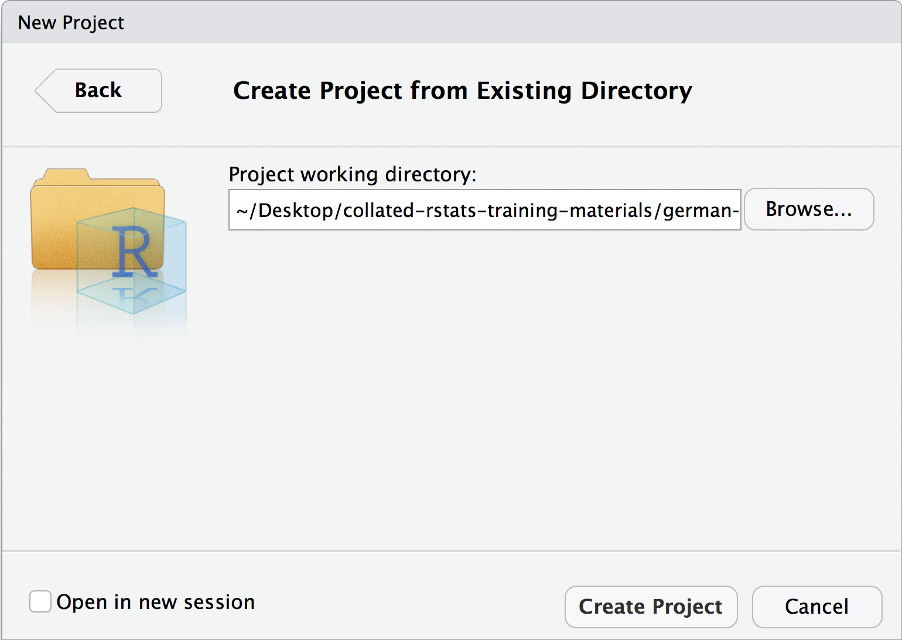
]

---

background-color: #def3f7

# `r emo::ji("memo")` Task: RStudio Projects Round Trip
<p class='task-slide-count'>SLIDE 4 OF 4</p>

RStudio will then reload and the files tab will show the contents of your folder, plus a new file called `01-workshop.Rproj`.

This `01-workshop.Rproj` file is the project file. Let's prove it by completing the round trip.

1. Close RStudio

1. Navigate to the `01-workshop` folder and open the `01-workshop.Rproj` file

1. Voila. RStudio has opened the project.

---

class: inverse, center, middle

# RMarkdown

---

# What does RMarkdown allow us to do?

.pull-left[

RMarkdown is a technology that allows us to write reports, slide decks and more in R.

This is really powerful because it allows us to closely connect our data, code, analysis **and the text we write about these things**.

We can also programmatically many reports.

]

.pull-right[]

<a href='https://funderscommittee.org/2020censusstatereports/', target='_blank'>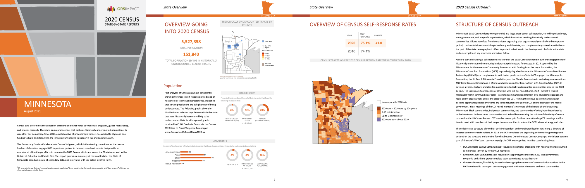</a>

---

# What does RMarkdown allow us to do?

.pull-left[

<span style='opacity:0.3'>RMarkdown is a technology that allows us to write reports, slide decks and more in R.</p>


]

.pull-right[

RMarkdown is also a very powerful tool for doing *Exploratory Data Analysis* (EDA).

EDA is the process we go through when we first get a dataset (or a question) and we want to understand it.

It's much easier to annotate your thought process in an RMarkdown document than an R script file... we call these tools *literate programming environments*.

]

> Jupyter notebooks are also useful for EDA, however on their own do not provide good solutions for generating [high-quality] reports and slide decks.

---

# We need to talk about Quarto

.pull-left[

You might read things about something called Quarto.

Quarto is the next generation of RMarkdown that works for; R, Python, Julia and Observable JS.

- Your assessment uses RMarkdown (I can't change that!)

- It is very simple to change an RMarkdown document to work with Quarto.

- Later in the course we can discuss if you want me to teach you Quarto.

]

.pull-right[
<div class='center2'>
<a href='https://www.youtube.com/watch?v=yvi5uXQMvu4'>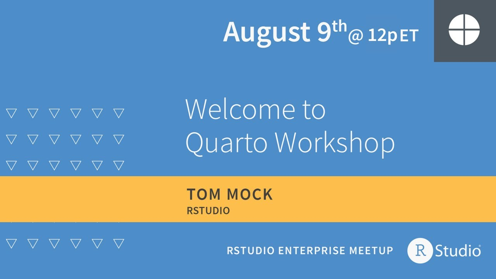</a>
</div>
]

---

# ... lets also talk about RStudio/Posit

.pull-left[

The RStudio application we're using is built by a that *was* called RStudio but rebranded in July 2022 to Posit.

The RStudio application will always be called RStudio, but other tools will change name

The company rebranded because they're expanding the scope of their toolings to support more languages than just R.

- Quarto is the biggest demonstration of this

- Shiny for Python is something we'll talk about in the back end of the course.

]

.pull-right[
<div class='center2'>
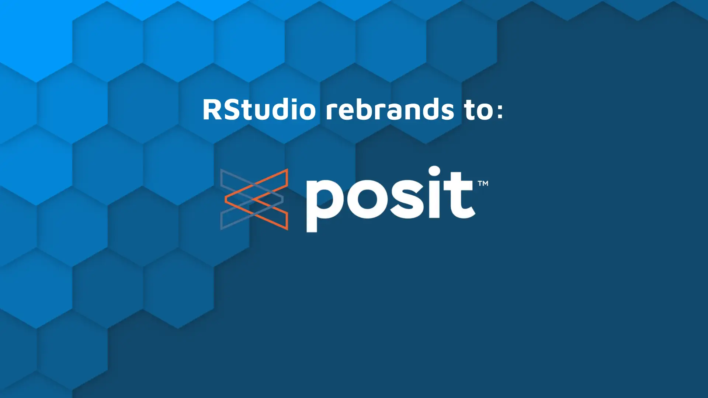
</div>
]

---

class: inverse, center, middle

# (Palate cleanser)

---

class: inverse, center, middle

# What can we make with RMarkdown?

---

# Output File Types

There are three very different types of "document" we can output with the `rmarkdown` package:

- PDF (for print and transportability)
- HTML (for the web and mobile)
- .docx (for when you're held hostage)

Let's address each of these in turn.

---

# RMarkdown PDF

RMarkdown relies on `LaTeX` to generate PDF, which means you need to install more stuff:

- Windows users: [https://miktex.org/download](https://miktex.org/download)
- Everyone else: [https://www.latex-project.org/get/](https://www.latex-project.org/get/)

It's possible to build both PDF presentations and reports with RMarkdown.

.pull-left[
**Reports** (pdf_document)

Practical format for short articles.
]

.pull-right[
**Presentations** (beamer_presentation)

Practical for presentations without interactive content.
]
---

# Bookdown for long-form PDF

RMarkdown was not built for the heavy-duty work of creating books - it has some issues surrounding enumeration and citations that are frustrating.

We **highly recommend** that you use [`bookdown`](https://bookdown.org/yihui/bookdown/) if writing long-form documents rather than short articles.

- `bookdown` was used to write the [R for Data Science](http://r4ds.had.co.nz/) book.
- `bookdown` creates both a web (HTML) and print (PDF) version of your documents.

<br>
<br>
<br>
<a href='https://bookdown.org/yihui/bookdown/' target='_blank'></a>

---

# RMarkdown HTML

The `rmarkdown` package allows us to create two types of HTML document:

- `html_document`: A single web page
- `slidy_presentation` & `ioslides_presentation`: Two different formats for creating a HTML presentation; a document split into slides.

---

# blogdown for websites

The `blogdown` is an incredible package for creating a website (including a blog engine) directly from RMarkdown.

Our website [visibledata.co.uk](https://visibledata.co.uk) was developed with `blogdown`.

- Our website lives on GitHub: [https://github.com/visibledata/visibledata.github.io](https://github.com/visibledata/visibledata.github.io)

- GitHub uses Hugo to generate our website (this service is called [Github Pages](https://pages.github.com/)).

- We use [Netlify.com](http://netlify.com/) for continuous integration and beta-testing of our site on top of this.

<a href='https://bookdown.org/yihui/blogdown/' target='_blank'></a>

---

# xaringan for beautiful slides

The built-in RMarkdown HTML presentation formats (ioslides and slidey) have many limitations.

The `xaringan` package allows beautiful and well-featured presentations to be written in RMarkdown.

- These lecture slides are written exclusively in `xaringan`

<a href='https://slides.yihui.name/xaringan/#1' target='_blank'></a>

---

# Why xaringan?

One of my favourite features is what it prevents me from doing.

<br>

There's a natural limit on how much content you can fit into a slide. 

This is essentially how much stuff **you should fit on a slide**.

---

class: inverse, center, middle

# RMarkdown basics

---
background-color: #def3f7

# `r emo::ji("memo")` Task: Create a new RMarkdown document

Let's create a new project called `rmarkdown-basics`

.pull-left[
1. File -> New -> R Markdown

If you don't see this dialog, run `install.packages("rmarkdown")`

<center></center>
]

.pull-right[


2\. Click "Ok"

3\. Save this file as `first-rmarkdown-document.Rmd`
]

---
background-image: url(images/rmarkdown-annotated.png)
background-color: white
background-size: contain
class: center, bottom, inverse

---
background-color: #def3f7

# `r emo::ji("memo")` Task: Generating output from .Rmd

We're currently looking at the source .Rmd file.

To generate the output document, we need to **knit** the document together:

1. Always save your .Rmd file before generating output.

1. Click the knit button


---

# Preview in... (I)

By default, RMarkdown documents will be previewed in a new window within the RStudio application.

It's important to understand what's happened here:

1. The `{knitr}` package has created a new `.html` file in your project directory

1. RStudio has then opened the `.html` file in either the `Viewer` tab or a new window.

You can change this behaviour by clicking on the cog next to the **knit** button:

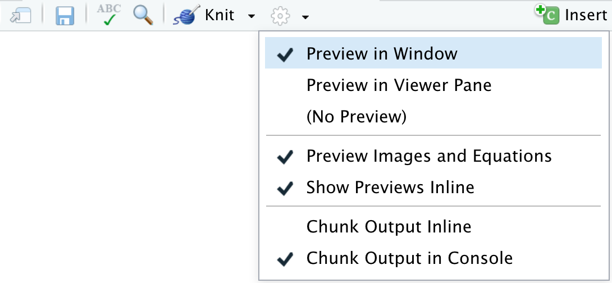

---

# Preview in... (II)

RStudio can preview the `.html` file **because it's a browser built on Chromium**.

However, it's a rubbish web browser. There are many types of content that won't display correctly in RStudio's viewer.

It's **highly recommended** that you view the output in your default browser<sup>1</sup>

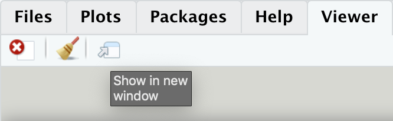

.footnote[
[1] Microsoft recommend that Windows users switch from Internet Explorer (IE) to Microsoft Edge. IE will not correctly display your RMarkdown `.html` output.
]

---

# RStudio's Visual Editor

.pull-left[
I'm usually very pessimistic about visual editors, but the RStudio visual editor for RMarkdown.

**However it does not work for ALL output types**.

It **DOES** work for the assessment format you need to use.
]

.pull-right[
<div class='center2'>

</div>
]


