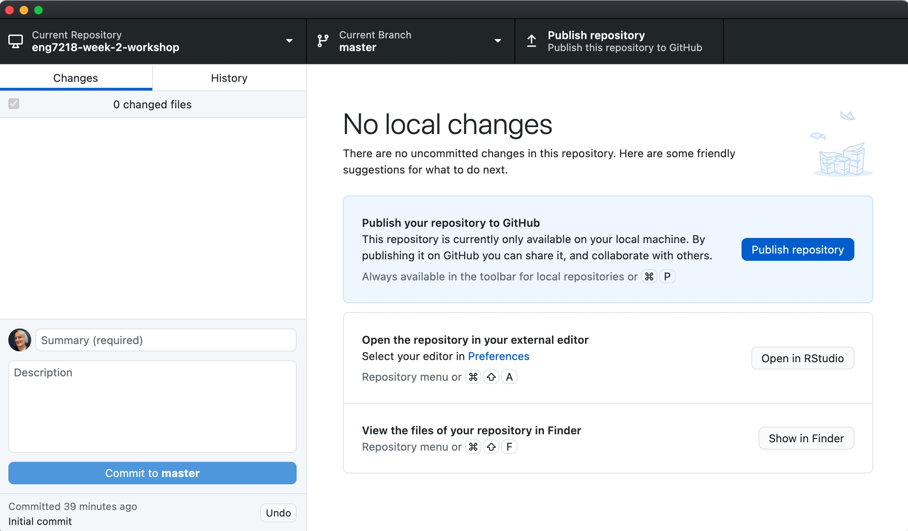
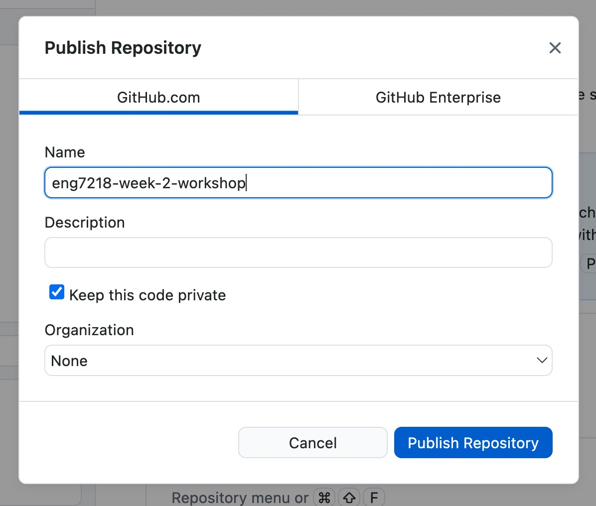
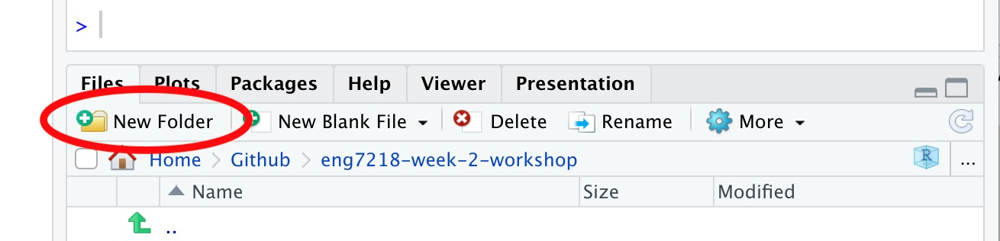
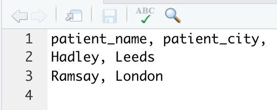
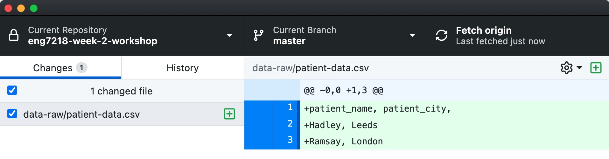
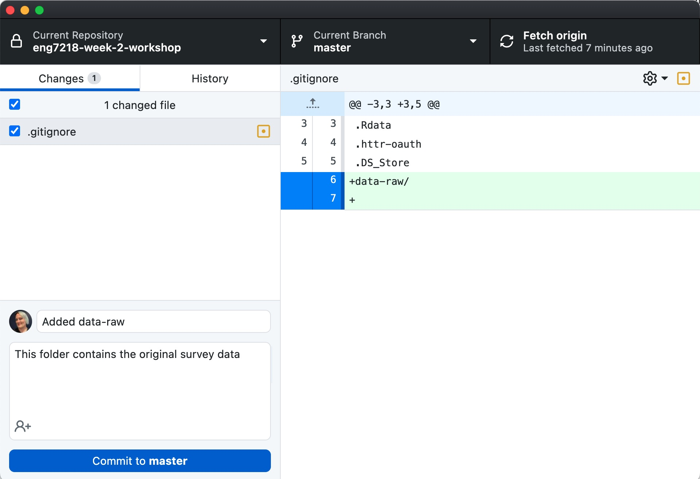
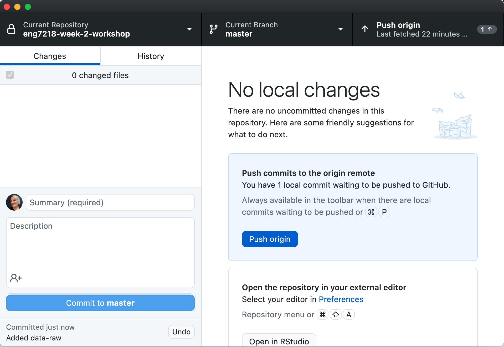
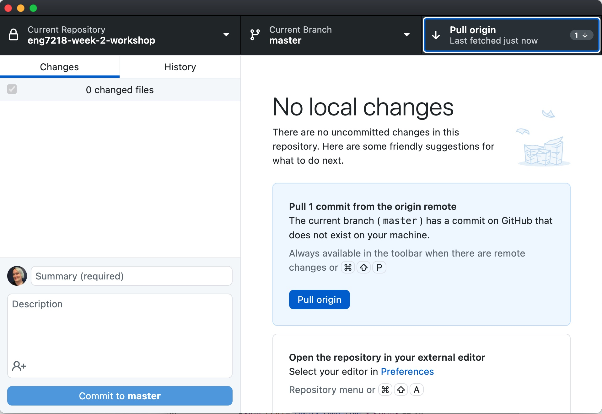
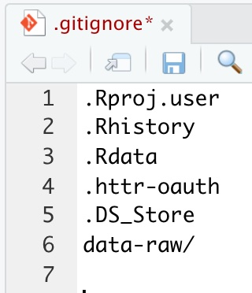

class: split-two, with-thick-border border-black

```{r setup, include=FALSE}
# don't mind this code chunk, it just sets up a few things for the rest
# it doesn't appear, because the include argument above is FALSE...
options(htmltools.dir.version = FALSE, servr.daemon = TRUE)
knitr::opts_chunk$set(cache=TRUE, autodep = TRUE, fig.retina = 3, message = FALSE, warning = FALSE)
```

```{r, echo=FALSE}
xaringanExtra::use_progress_bar(color = "#36506A", location = "top", height = "5px")
```


.column.bg-main1[.content[
  .split-three[
 .row[.content[
 # 1. Reproducible code
 ]]
  .row[.content[
 # 2. Reproducible referencing
 ]]
   .row[.content[
 # 3. Working with datasets in R reproducibly
 ]]
 ]
]]

.column.bg-main1[.content.center.vmiddle[
  # 4. Understanding the assessment template
]]

---

class: inverse, middle, center

# Reproducible code

---

# Reseach code is research software

If your research includes R code that reads and wrangles your data in such a way that you can:

- Create charts

- Test statistical hypotheses are compute statistical measures

- Calculate measures of your data

... then you're writing research software and it's an intrinsic part of your research.

<hr>

You might even develop your R code into an R package that others can reuse for similar analyses. 

However, that's definitely beyond the scope of this course.

> Now you're writing software we need to equip you with some software development tools

---

# Version control with git

.pull-left[

Version control is extremely important in software development to ensure future changes to code don't break existing code.

This is particularly true when code is being worked on by multiple people.

]

.pull-right[

]

---

# Version control with git

.pull-left[

Version control is extremely important in software development to ensure future changes to code don't break existing code.

This is particularly true when code is being worked on by multiple people.

The most widely used version control tool used today is called `git`.

`git` is an extremely powerful, open-source tool.

> We are going to ignore almost all of its features and use only what we need.
> 
> Just like most people who use it.
]

.pull-right[

<center>

https://xkcd.com/1597/
<center>
]

---

# git repositories

Each individual project that uses `git` is called a **repository**.

If you decided to use `git` to version control your assignment then that would be a repository.

---

# git and the command line

`git` was originally designed to be used in the command line

- On Windows that usually means using cmd.exe

- On macOS and Linux that means the Terminal

This practically means that you'd be using a *command line interface* (CLI) to work with the git technology.

<hr>

In the case of `git` it can be beneficial to use a GUI interface instead of the CLI to conceptualise what actions you're about to - and often more importantly - what actions were taken in the past.

---

# GitHub

.pull-left[

GitHub is one of many different tools for managing *git repositories*.

We're going to prefer GitHub because it has lots of really awesome features.

It's also owned by Microsoft which **radically** simplifies installing `git` onto your machine.

<hr>

Let's first create an account.

1. Visit [github.com](https://github.com/) and click sign-up (if you don't already have an account)

1. Don't worry about being creative with your username now - you can change it later without things exploding *too much*.

]

.pull-right[

]

---

# GitHub Desktop

.pull-left[

When you install GitHub Desktop it installs both `git` and a GUI for working with repositories on GitHub.

1. Download the application from [desktop.github.com/](https://desktop.github.com)

1. Run through the installer

1. Sign-in with your GitHub account.
]

.pull-right[

]

---

# Organising your computer

From this point onwards we need to be careful about organising our code.

- RStudio projects should **not** contain projects themselves

- Git repositories should **never** contain another git repository<sup>1</sup>

It's best practice to have **one folder** on your machine call GitHub and for all repositories to be stored in that folder.

.footnote[
[1] This is getting into quite advanced territory, but if you needed a repo to depend on another you would use [submodules](https://git-scm.com/book/en/v2/Git-Tools-Submodules).
]

---

# Creating a new repository

.pull-left[

We're going to make use of the `{usethis}` package to help us create a well-formed new repository.

> Please open RStudio and install the {usethis} package.

]

.pull-right[
<center>

<br>

</center>
]

---

# Creating a new repository

.pull-left[

We're going to make use of the `{usethis}` package to help us create a well-formed new repository.

I'm going to demonstrate how to do this first **afterwards** I'll show the instructions and then create your own repository.

]

.pull-right[
<center>

<br>

</center>
]

---

# Creating a new repository

.pull-left[

1\. In RStudio use the "Project Menu" choose

  - New Project...
  
  - New directory
  
  - New project
  
2\. Set the name of the directory as `eng7218-week-2-workshop`

3\. Create the project as a subdirectory of your GitHub folder
]

.pull-right[

4\. Inside of this project run this in the R console

```{r, eval=FALSE}
usethis::use_git()
```

5\. Open GitHub Desktop and select

```{markdown}
File > Add Local Repository
```

]

---

# Publish to GitHub.com

If everything is good your GitHub Desktop will look like this - let's publish the repository!



---

# Publish to GitHub.com

.pull-left[
- We then get to name the repository on Github.com - use the same name!!

- We then get to choose if our code is private or not

  - If you're applying an embargo to your data, you probably want to do the same on GitHub!
  
  - Public repositories can be seen by anyone and are useful for your CV
]

.pull-right[

]

---

# Let's add some sensitive data to the repo (I)

When adding data to your repository it's important to have **two** directories.

- `data-raw` contains your sensitive data and data anonymisation scripts

- `data` contains a copy of your anonymous data

> We're going to prevent the `data-raw` folder from being sent to GitHub.com

---

# Let's add some sensitive data to the repo (II)

.pull-left[
1. Use the New Folder button to create a folder called `data-raw`

]

.pull-right[

]

---

# Let's add some sensitive data to the repo (II)

.pull-left[
1. Use the New Folder button to create a folder called `data-raw`

1. Click inside the `data-raw` folder in the Files tab

1. Select "Text file" from the "New Blank File" menu
]

.pull-right[

]

---

# Let's add some sensitive data to the repo (II)

.pull-left[
1. Use the New Folder button to create a folder called `data-raw`

1. Click inside the `data-raw` folder in the Files tab

1. Select "Text file" from the "New Blank File" menu

1. Add some fake data into the file

1. Save this file into the `data-raw` folder and call it something like `patient-data.csv`
]

.pull-right[

]

---

# Check GitHub Desktop

When you switch to GitHub Desktop we see that `git` has tracked changes in the repo.

We want to prevent this entire directory from going to GitHub

- The repo on your machine is called "the local repository"

- The repo on Github is called "the remote repository"



---

# Commit this change to the repository

.pull-left[

1\. Switch back to GitHub

2\. Add a commit message

> These should be short and sweet, like "added data-raw"

3\. **Optionally** add a summary

4\. Click "Commit to master"

]

.pull-right[

]

> In `git` when we "commit" something we tell `git` to remember our change in the local repository.

---

# Pushing our changes to the remote repository

.pull-left[
After committing locally it's time to **push** the changes to GitHub.com

Click the "push origin" button and the changes will be sent to the remote!
]

.pull-right[

]

---

# Pulling is the opposite of pushing

.pull-left[

Remember that `git` is designed for collaboration.

Imagine a collaborator has pushed a change to the remote repository **but** you don't have those changes in your machine.

If you refresh GitHub Desktop you'll be prompted to "pull origin" - which will bring the changes to your local repository.
]

.pull-right[

]

---

# GitHub branches and pull requests

This is as far as we'll go with using `git` for version control.

In real-world projects you would use two additional features: branches and pull requests.

> There is a really good, simple to follow tutorial here: https://docs.github.com/en/get-started/quickstart/hello-world
>
> There are also tutorials on LinkedIn Learning.

---

# Modify the .gitignore file

.pull-left[
1. Switch back to RStudio

1. Go to the project directory

1. Open the `.gitignore` file

1. Add `data-raw/` to the file and **save it**
]

.pull-right[

]

---

class: inverse, center, middle

# Reproducible referencing

---

# 

---

XXXXXXXXXX DRAGONS XXXXXXXXXXXXX

# How to cite 

---

# Aside: Press Releases really suck

Earlier I linked to a [Harvard Press Release about prediction markets for replicability](https://www.seas.harvard.edu/news/2015/11/markets-science).

It's a perfect example of why University press releases often suck.

- The article does not give the title of the paper

- The article does not give the link to the paper


---

# Aside: Difficulty citing white papers

The Turing Report by `r citet_charlie("von_borzyskowski_data_2021")` I mentioned earlier is a great example of adding a non-traditional publication to Zotero.

1. Use "Report" as type

1. Manually add names

1. Infer the date of the report from the URL `turing.ac.uk/.../2021-06/...pdf`

1. Add "Accessed field"

1. Add URL

1. Add Institute

